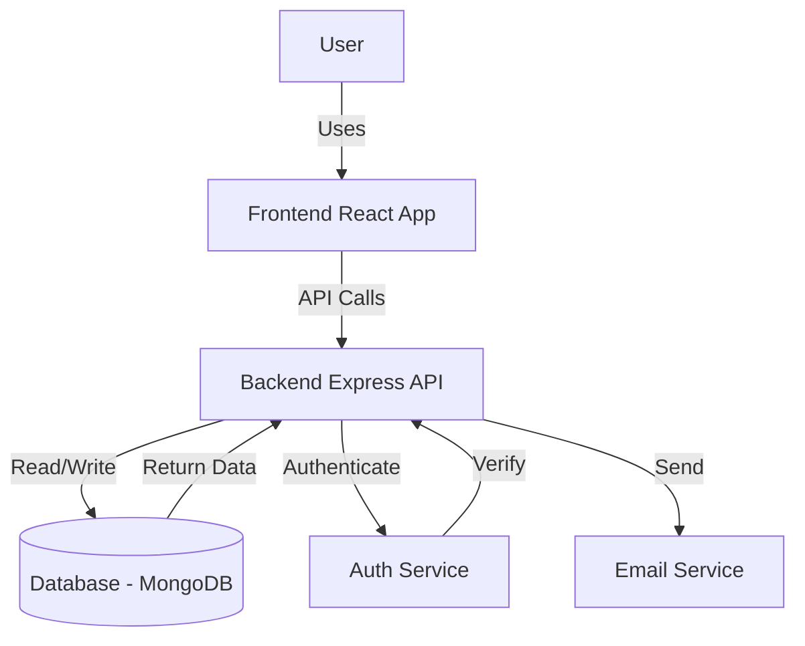

# Data Flow Diagram

This diagram illustrates how data moves through the Blog Management Application — from the end user's browser to the backend and database.

## Explanation

- **User** interacts with the React frontend
- **Frontend** sends API requests to the backend  
- **Backend** communicates with:
  - **Database** → for storing blogs, comments, users
  - **Auth Service** → for authentication & authorization
  - **Mail Service** → for notifications and newsletters