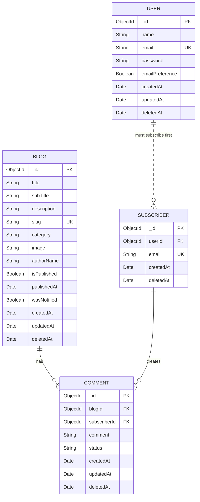

```mermaid
erDiagram
    BLOG ||--o{ COMMENT : "has"
    SUBSCRIBER ||--o{ COMMENT : "creates"
    USER ||..o{ SUBSCRIBER : "must subscribe first"

    BLOG {
        ObjectId _id PK
        String title
        String subTitle
        String description
        String slug UK
        String category
        String image
        String authorName
        Boolean isPublished
        Date publishedAt
        Boolean wasNotified
        Date createdAt
        Date updatedAt
        Date deletedAt
    }

    USER {
        ObjectId _id PK
        String name
        String email UK
        String password
        Boolean emailPreference
        Date createdAt
        Date updatedAt
        Date deletedAt
    }

    COMMENT {
        ObjectId _id PK
        ObjectId blogId FK
        ObjectId subscriberId FK
        String comment
        String status
        Date createdAt
        Date updatedAt
        Date deletedAt
    }

    SUBSCRIBER {
        ObjectId _id PK
        ObjectId userId FK
        String email UK
        Date createdAt
        Date deletedAt
    }
```
