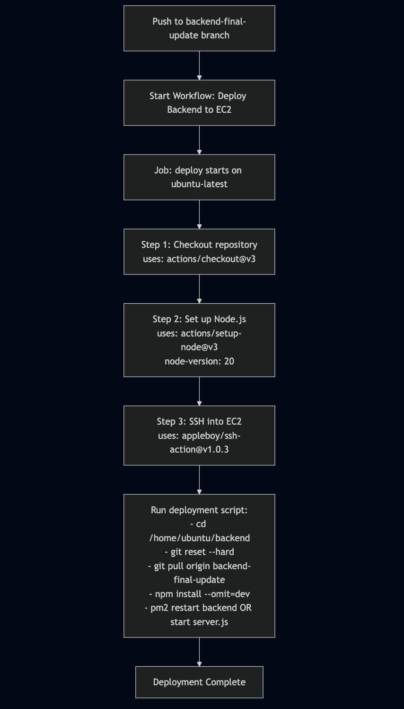
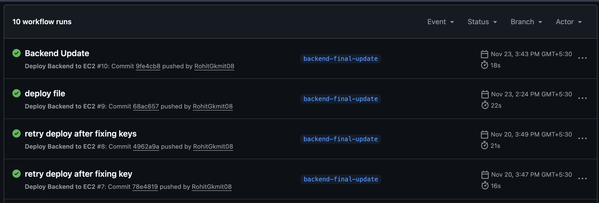

# CI/CD Workflow

This document describes the **Continuous Integration and Continuous Deployment (CI/CD)** pipeline implemented for the **DailyPost** application, specifically for backend deployment to AWS EC2.

---

## What is CI/CD?

**Continuous Integration (CI)** and **Continuous Deployment (CD)** are DevOps practices that automate the process of building, testing, and deploying applications. 

- **CI** ensures that code changes are automatically tested and integrated into the main codebase, catching issues early in the development cycle.
- **CD** automates the deployment process, allowing code changes to be automatically deployed to production environments after passing all tests and checks.

Together, CI/CD reduces manual errors, speeds up delivery, and ensures consistent deployments across environments.

---

## Workflow Overview

The backend deployment workflow is triggered automatically when code is pushed to the `backend-final-update` branch. The entire process is orchestrated using **GitHub Actions**, a CI/CD platform integrated with GitHub repositories.

---

## Deployment Workflow Steps

### 1. Trigger Event
**Event:** Push to `backend-final-update` branch

The workflow is automatically initiated when a developer pushes code changes to the `backend-final-update` branch in the repository.

---

### 2. Workflow Initiation
**Action:** Start Workflow: Deploy Backend to EC2

GitHub Actions detects the push event and starts the deployment workflow.

---

### 3. Job Environment Setup
**Environment:** `ubuntu-latest`

The deployment job runs on a GitHub-hosted runner using the latest Ubuntu environment, providing a clean, consistent execution environment.

---

### 4. Step 1: Checkout Repository
**Action:** `actions/checkout@v3`

This step retrieves the source code from the repository, making it available for subsequent steps in the workflow.

---

### 5. Step 2: Set up Node.js
**Action:** `actions/setup-node@v3`  
**Node Version:** 20

Configures the environment with Node.js version 20, ensuring the correct runtime environment for the backend application.

---

### 6. Step 3: SSH into EC2
**Action:** `appleboy/ssh-action@v1.0.3`

Establishes a secure SSH connection to the Amazon EC2 instance where the backend application is hosted. This step uses SSH keys configured as GitHub secrets for secure authentication.

---

### 7. Step 4: Run Deployment Script

Once connected to the EC2 instance, the following commands are executed:

cd /home/ubuntu/backend
git reset --hard
git pull origin backend-final-update
npm install --omit=dev
pm2 restart backend OR start server.js**Command Breakdown:**
- `cd /home/ubuntu/backend`: Navigates to the backend application directory
- `git reset --hard`: Discards any local changes that might conflict with the deployment
- `git pull origin backend-final-update`: Pulls the latest code from the repository
- `npm install --omit=dev`: Installs production dependencies only (excludes development dependencies)
- `pm2 restart backend`: Restarts the application using PM2 process manager (or starts the server if not running)

---

### 8. Deployment Complete

Upon successful execution of all steps, the deployment is marked as complete, and the application is live with the latest changes.

---

## Workflow Visualization

*The diagram above illustrates the complete deployment workflow from code push to successful deployment.*

---

## Workflow Run History

The GitHub Actions interface provides visibility into all workflow runs, showing:

- **Status:** Success (✓) or failure indicators
- **Branch:** The branch that triggered the deployment
- **Timestamp:** When the deployment occurred
- **Duration:** Time taken to complete the deployment (typically 16-22 seconds)
- **Commit Information:** Details about the commit that triggered the deployment

*Example workflow run history showing successful deployments to the backend-final-update branch.*

---

## Key Benefits

1. **Automated Deployments:** Eliminates manual deployment steps and reduces human error
2. **Fast Deployment:** Complete deployment cycle in under 30 seconds
3. **Consistency:** Every deployment follows the same process, ensuring reliability
4. **Visibility:** Clear history and status of all deployments
5. **Rollback Capability:** Easy to identify and revert to previous working versions if needed

---

## Security Considerations

- SSH keys are stored as GitHub secrets and never exposed in logs
- Only authorized branches trigger deployments
- Production dependencies are installed, reducing attack surface
- PM2 ensures process stability and automatic restarts

---

## Summary

The CI/CD pipeline for **DailyPost** backend ensures:

- **Automated** deployment process from code push to production
- **Fast** deployment cycles (typically 16-22 seconds)
- **Reliable** and consistent deployments
- **Secure** authentication and execution
- **Transparent** workflow history and monitoring

This setup enables rapid iteration and deployment while maintaining high standards of reliability and security.

---