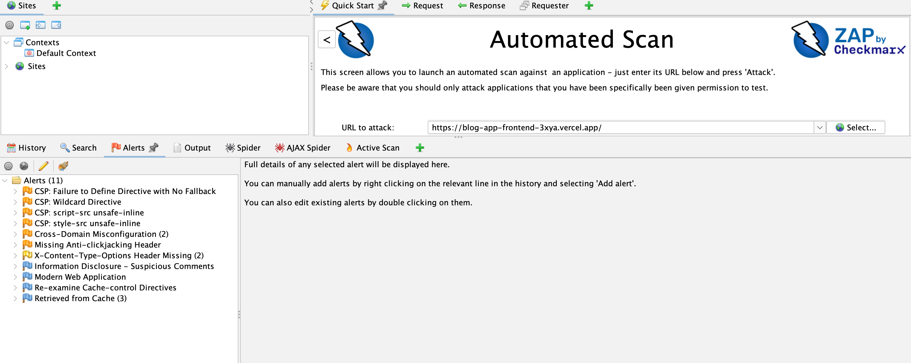
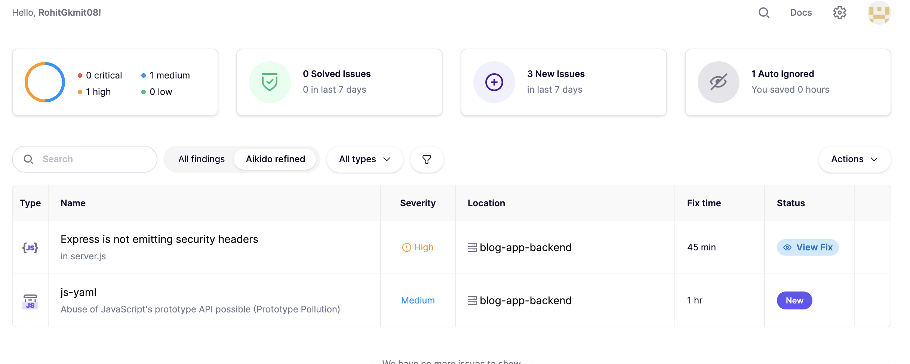

# 17. Security Scans

This document outlines the security threats, scanning tools, and remediation strategies for the **DailyPost** application.

---

## What are Security Threats?

Security threats are potential vulnerabilities and risks that can compromise the security of the DailyPost application. Common threats include:

### 1. Cross-Site Scripting (XSS)
- **Description:** Attackers inject malicious scripts into web pages
- **Impact:** Steal user data, session hijacking, defacement
- **Prevention:** Input validation, output encoding, Content Security Policy

### 2. SQL/NoSQL Injection
- **Description:** Attackers inject malicious queries into database operations
- **Impact:** Unauthorized data access, data manipulation, data deletion
- **Prevention:** Parameterized queries, input validation, ORM usage

### 3. Cross-Site Request Forgery (CSRF)
- **Description:** Attackers trick users into performing unwanted actions
- **Impact:** Unauthorized actions on behalf of users
- **Prevention:** CSRF tokens, SameSite cookies, origin validation

### 4. Clickjacking
- **Description:** Attackers overlay malicious content over legitimate pages
- **Impact:** Users tricked into clicking hidden elements
- **Prevention:** X-Frame-Options header, CSP frame-ancestors

### 5. Security Header Missing
- **Description:** Missing security headers expose application to various attacks
- **Impact:** MIME sniffing, protocol downgrade, information disclosure
- **Prevention:** Implement security headers (helmet.js)

### 6. Dependency Vulnerabilities
- **Description:** Third-party packages with known security vulnerabilities
- **Impact:** Exploitation of vulnerable dependencies
- **Prevention:** Regular dependency updates, vulnerability scanning

### 7. Authentication Bypass
- **Description:** Weak authentication mechanisms allow unauthorized access
- **Impact:** Unauthorized access to admin features
- **Prevention:** Strong passwords, secure session management, MFA

### 8. Information Disclosure
- **Description:** Sensitive information exposed in errors, comments, or headers
- **Impact:** Attackers gain information about system architecture
- **Prevention:** Secure error handling, remove sensitive comments

---

## Security Scanning Tools

### 1. OWASP ZAP (Zed Attack Proxy)

**What it does:**
- Scans web applications for security vulnerabilities
- Tests API endpoints for security issues
- Identifies misconfigurations and missing security headers
- Provides detailed vulnerability reports

**How it works:**
1. Crawls the application to discover pages and endpoints
2. Performs active security testing
3. Identifies vulnerabilities and categorizes them by risk
4. Generates reports with remediation guidance

**What it finds:**
- Missing security headers (X-Frame-Options, CSP, HSTS)
- Content Security Policy issues
- Cross-origin resource sharing (CORS) misconfigurations
- Information disclosure vulnerabilities
- Cache configuration issues

---

### 2. Aikido Security

**What it does:**
- Continuously monitors codebase for security issues
- Scans dependencies for known vulnerabilities
- Identifies code-level security problems
- Provides fix time estimates and remediation steps

**How it works:**
1. Monitors code changes in real-time
2. Scans npm dependencies for known CVEs
3. Analyzes code for security anti-patterns
4. Alerts on new security issues

**What it finds:**
- Vulnerable dependencies (e.g., js-yaml prototype pollution)
- Missing security headers in Express.js
- Code-level security issues
- Infrastructure security problems

---

## Security Scan Results Summary

### OWASP ZAP Findings
- **CSP Issues:** 4 (Medium-Low risk)
- **Security Headers:** 3 (Medium-Low risk)
- **CORS Issues:** 2 (Medium risk)
- **Information Disclosure:** 2 (Low risk)
- **Cache Issues:** 4 (Low-Informational)

### Aikido Findings
- **High Severity:** 1 (Missing security headers)
- **Medium Severity:** 1 (js-yaml vulnerability)
---

## Best Practices

1. **Scan Regularly:** Run security scans before deployments and weekly
2. **Fix High Priority First:** Address critical vulnerabilities immediately
3. **Keep Dependencies Updated:** Regularly update npm packages
4. **Use Security Headers:** Always implement security headers (helmet.js)
5. **Validate Input:** Validate and sanitize all user inputs
6. **Secure Authentication:** Use strong passwords and secure sessions
7. **Monitor Continuously:** Use tools like Aikido for continuous monitoring
8. **Document Fixes:** Keep track of security fixes and improvements

---

